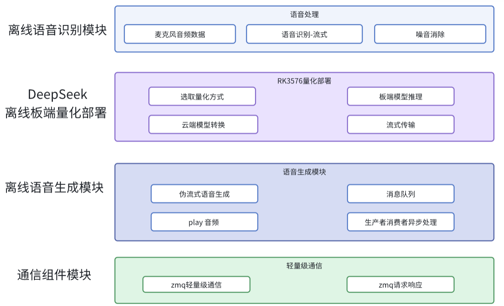

# 端侧部署C++项目-基于DeepSeek与RK3576的模块化离线智能语音交互系统

## 项目视频文档解析
**添加微信**：auto_drive_yue

## 项目概述

本项目开发了一套**全离线、模块化**的智能语音交互系统，基于RK3576 NPU实现端到端智能语音交互流水线，集成**流式ASR、DeepSeek大模型推理、TTS语音合成-双缓冲队列**三大核心模块。系统采用松耦合架构，各模块通过**标准化接口(封装ZeroMQ通信协议)**交互，在嵌入式环境下实现4秒内的**语音输入→LLM思考→语音输出闭环**。

## 项目技术栈
**技术栈**：Linux、C++、ASR、RK芯片云端量化/端侧部署、TTS、ZeroMQ、CMake、多线程

## 项目架构
 

## 核心特性

- 🚀 **全离线部署**：不依赖云端服务，基于RK3576 NPU实现本地化推理
- 🔧 **模块化架构**：ASR/TTS/LLM模块通过ZeroMQ松耦合通信
- ⚡ **低延迟优化**：流式ASR + 双缓冲TTS队列实现快速响应

