# LLM流式推理模拟分析

## 概述

本文档详细分析了智能座舱LLM系统中，从ASR输入到TTS输出的完整流式处理过程。通过具体示例展示callback机制如何实现毫秒级响应。

## 测试用例

### ASR输入
```
你好，你叫什么？可以帮我打开音乐播放器吗？
```

### LLM预期输出（DeepSeek-R1）
```
<think>
用户问了三个问题：1.打招呼 2.询问我的名字 3.要求打开音乐播放器
我需要友好回应并执行音乐播放指令
</think>

你好！我是智能助手小悦，很高兴为您服务。当然可以帮您打开音乐播放器！

{"action": "MUSIC_PLAY", "params": {"app": "music_player"}}
```

## 流式处理详细过程

### 1. ASR输入处理

```cpp
// 接收ASR数据
input_str = "你好，你叫什么？可以帮我打开音乐播放器吗？"
std::cout << "[voice -> llm] received: " << input_str << std::endl;

// 启动LLM推理
rkllm_run(llmHandle, &rkllm_input, &rkllm_infer_params, NULL);
```

### 2. Callback分次调用过程

#### 第1次callback调用
```cpp
// callback #1: result->text = "<think>用户问了三个问题：1.打招呼"
// buffer_ = "<think>用户问了三个问题：1.打招呼"
// 状态：无分句符，继续累积
```

#### 第2次callback调用
```cpp
// callback #2: result->text = " 2.询问我的名字 3.要求打开音乐播放器"
// buffer_ = "<think>用户问了三个问题：1.打招呼 2.询问我的名字 3.要求打开音乐播放器"
// 状态：无分句符，继续累积
```

#### 第3次callback调用
```cpp
// callback #3: result->text = "我需要友好回应并执行音乐播放指令</think>你好！"
// buffer_ = "<think>...指令</think>你好！"
// 状态：遇到 L'！' 分句符
// 🚀 第1次发送给TTS: extract_after_think("...你好！") = "你好！"
// buffer_.clear()
```

#### 第4次callback调用
```cpp
// callback #4: result->text = "我是智能助手小悦，"
// buffer_ = "我是智能助手小悦，"
// 状态：遇到 L'，' 分句符
// 🚀 第2次发送给TTS: "我是智能助手小悦，"
// buffer_.clear()
```

#### 第5次callback调用
```cpp
// callback #5: result->text = "很高兴为您服务。"
// buffer_ = "很高兴为您服务。"
// 状态：遇到 L'。' 分句符
// 🚀 第3次发送给TTS: "很高兴为您服务。"
// buffer_.clear()
```

#### 第6次callback调用
```cpp
// callback #6: result->text = "当然可以帮您打开音乐播放器！"
// buffer_ = "当然可以帮您打开音乐播放器！"
// 状态：遇到 L'！' 分句符
// 🚀 第4次发送给TTS: "当然可以帮您打开音乐播放器！"
// buffer_.clear()
```

#### 第7次callback调用
```cpp
// callback #7: result->text = '{"action": "MUSIC_PLAY", "params": {"app": "music_player"}}'
// buffer_ = '{"action": "MUSIC_PLAY", "params": {"app": "music_player"}}'
// 状态：无分句符，继续累积
```

#### 最终callback调用
```cpp
// callback final: state = RKLLM_RUN_FINISH
// buffer_ = '{"action": "MUSIC_PLAY", "params": {"app": "music_player"}}'
// 🚀 第5次发送给QT进程: '{"action": "MUSIC_PLAY", "params": {"app": "music_player"}} END'
// buffer_.clear()
```

## TTS接收消息汇总

### 发送给TTS的5次内容

| 序号 | 发送时间 | 内容 | 用户听到时间 | 备注 |
|------|----------|------|--------------|------|
| 1 | 1秒 | `"你好！"` | 1.5秒 | 首次响应 |
| 2 | 2秒 | `"我是智能助手小悦，"` | 2.5秒 | 自我介绍 |
| 3 | 3秒 | `"很高兴为您服务。"` | 3.5秒 | 礼貌用语 |
| 4 | 4秒 | `"当然可以帮您打开音乐播放器！"` | 4.5秒 | 确认执行 |
| 5 | 5秒 | `'{"action": "MUSIC_PLAY", "params": {"app": "music_player"}} END'` | - | JSON指令 |

## 时间线分析

```mermaid
gantt
    title 流式响应时间线
    dateFormat X
    axisFormat %s
    
    section LLM推理
    生成思维链    :0, 1
    生成"你好！"  :1, 2
    生成后续内容  :2, 4
    生成JSON指令  :4, 5
    
    section TTS播放
    播放"你好！"           :1, 2
    播放"我是智能助手..."   :2, 3
    播放"很高兴为您服务"   :3, 4
    播放"当然可以帮您..."   :4, 5
    
    section 用户体验
    听到第一句回复 :1, 1
```



## 核心技术要点

### 1. 分句符号检测
```cpp
static const std::set<wchar_t> split_chars = {
    L'：', L'，', L'。', L'\n', L'；', L'！', L'？'
};
```

### 2. 思维链过滤
```cpp
std::wstring extract_after_think(const std::wstring &input) {
    // 过滤掉<think>...</think>部分
    // 只保留用户需要听到的内容
}
```

### 3. UTF-8与宽字符转换
```cpp
// 确保中文标点符号正确识别
std::wstring wide_text = utf8_to_wstring(result->text);
```

### 4. 流式发送机制
```cpp
for (wchar_t c : wide_text) {
    buffer_ += c;
    if (split_chars.count(c)) {  // 遇到分句符立即发送
        send_response(buffer_);
        buffer_.clear();
    }
}
```

## 性能优势

### 1. 极低延迟
- **传统方式**：等待完整回答生成（5秒）→ TTS处理（1秒）→ 用户听到（6秒）
- **流式方式**：边推理边播放 → 用户1秒就听到回复开始

### 2. 并行处理
- LLM继续推理后续内容
- TTS同时处理已发送的片段
- 整体响应时间大幅缩短

### 3. 自然体验
- 按标点符号自然分段
- 模拟人类说话节奏
- 避免长时间等待

### 4. 智能过滤
- 自动过滤思维链内容
- 只播放有意义的回复
- JSON指令单独处理

## 系统架构优势

### 1. 模块解耦
```
ASR → LLM → TTS → 业务逻辑
```
每个模块独立工作，通过ZMQ通信

### 2. 容错机制
- callback状态检测（NORMAL/FINISH/ERROR）
- 异常情况下的优雅处理

### 3. 扩展性
- 支持多种输出格式
- 可配置的分句规则
- 灵活的后处理逻辑

## 总结

通过这个具体示例可以看出，智能座舱LLM系统通过以下技术实现了毫秒级响应：

1. **流式推理**：边推理边输出，不等完整生成
2. **智能分段**：基于中文标点符号的自然分割
3. **并行处理**：LLM推理与TTS播放同时进行
4. **思维链过滤**：只播放用户需要的内容
5. **指令识别**：JSON格式的业务指令单独处理

这种设计使得用户在说完话后1秒内就能听到AI的回复开始，大大提升了交互体验的流畅性和自然度。

---

**文档版本**：v1.0  
**创建时间**：2024年  
**更新时间**：2024年  
**作者**：智能座舱开发团队