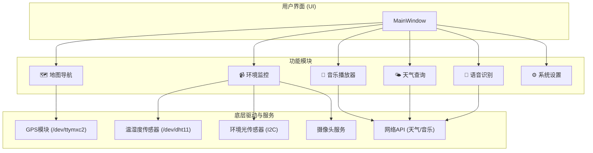

# 🚗 智能车载终端系统

[](https://isocpp.org/)
[](https://www.qt.io/)
[](https://cmake.org/)
[](https://www.linux.org/)

这是一个基于 **Qt 5.15** 框架和 **C++** 开发的嵌入式Linux智能车载终端（In-Vehicle Infotainment, IVI）系统。它集成了地图导航、多媒体娱乐、环境监控和语音助手等多种功能，旨在为用户提供现代化、智能化的车载交互体验。

## ✨ 主要功能

- **🎵 音乐播放器**: 支持本地音乐扫描与播放，集成网易云音乐API，可进行在线搜索、播放和歌词显示。
- **🗺️ 地图导航**: 集成百度地图服务，通过硬件GPS模块 (`/dev/ttymxc2`) 进行实时定位和导航。
- **🌤️ 天气查询**: 调用网络API，提供实时的天气信息和天气预报。
- **📹 环境监控**:
    - **视频监控**: 通过摄像头进行实时视频采集。
    - **环境感知**: 集成DHT11温湿度传感器和AP3216c环境光/距离传感器，实时显示环境数据。
- **🎤 语音识别**: 支持语音指令，可控制音乐播放、地图导航等核心功能。
- **⏰ 实用工具**: 包含美观的数字时钟和系统设置面板。
- **👆 手势操作**: 主界面支持滑动切屏操作。

## 🏛️ 系统架构

系统采用模块化设计，主窗口 (`MainWindow`) 作为入口，统一调度和管理各个功能模块。底层通过驱动直接与硬件交互，并通过网络API获取在线服务。



## 🛠️ 技术栈

- **核心框架**: Qt 5.15.16 (Core, Gui, Widgets, Multimedia, Network, SerialPort)
- **编程语言**: C++11, C
- **构建系统**: CMake
- **依赖管理**: vcpkg & apt
- **硬件接口**: `/dev` (串口, I2C), Video4Linux2 (V4L2)
- **外部API**:
    - 网易云音乐 API
    - 百度地图 API
    - 在线天气 API

## 🚀 快速开始

请按照以下步骤在您的 **Ubuntu / Debian** 系统上设置、编译和运行本项目。

### 1. 安装系统依赖

首先，运行脚本安装所有必需的系统库和工具，如 `build-essential`, `cmake`, `bison`, 以及 `X11` 和 `OpenGL` 的开发库。

```bash
chmod +x install_dependencies.sh
sudo ./install_dependencies.sh
```

### 2. 安装Qt5库

项目使用 `vcpkg` 来管理Qt5库。此脚本将自动通过vcpkg下载和编译Qt 5.15的核心模块。
> **提示**: vcpkg 会自动缓存下载的源码和编译好的库。如果初次执行失败，修复依赖后再次运行此脚本会快很多。

```bash
chmod +x install_qt5.sh
./install_qt5.sh
```
> 如果遇到需要重建依赖的提示，请使用 `--recurse` 选项，脚本已为您配置好。

### 3. 编译项目

一切准备就绪后，运行构建脚本。它将使用CMake来配置项目并进行编译。
```bash
chmod +x build.sh
./build.sh
```

### 4. 运行程序

编译成功后，可执行文件将位于 `build/bin/` 目录下。
```bash
./build/bin/VehicleTerminal
```

## 👨‍💻 开发者说明

### 代码结构

- `VehicleTerminal/`: 项目主源码目录。
    - `main.cpp`: 程序入口。
    - `mainwindow.*`: 主窗口，UI和业务逻辑的核心。
    - `Map/`, `Music/`, `Weather/`, `Monitor/`: 各个核心功能模块。
    - `*.c`: C语言编写的底层硬件驱动接口。
- `*.sh`: 用于安装和构建的Shell脚本。
- `CMakeLists.txt`: 项目的构建配置文件。
- `*.pro`: 原始的QMake项目文件，当前已迁移至CMake。

### 开发环境配置 (Clangd)

为了获得最佳的开发体验（代码补全、语法检查），本项目已为 `clangd` 进行了优化配置。

1.  **生成编译数据库**: `build.sh` 脚本会自动在 `build/` 目录下生成 `compile_commands.json` 文件。
2.  **符号链接**: 脚本还会在项目根目录创建一个指向该文件的符号链接，方便 `clangd` 查找。
3.  **重启编辑器**: 首次构建后，请重启您的编辑器（如 VS Code / Cursor）以加载 `clangd` 配置。

### 注意事项

- **硬件依赖**: 本项目为嵌入式系统设计，部分功能（如GPS, 传感器）强依赖于特定的硬件设备文件（例如 `/dev/dht11`）。在非目标硬件上运行时，这些功能可能无法正常工作。代码中包含 `#if __arm__` 宏定义以在x86平台下提供模拟数据。
- **API密钥**: 您可能需要自行替换代码中硬编码的API密钥或URL以使用在线服务。
- **段错误调试**: 如果程序启动时遇到 `Segmentation fault`，通常是由于某个类的构造函数中指针未正确初始化或硬件模块初始化失败导致。请使用 `gdb` 进行调试：
  ```bash
  gdb ./build/bin/VehicleTerminal
  (gdb) run
  # 在程序崩溃后
  (gdb) bt
  ```
---

*这份 README 文档旨在提供清晰的项目指引。如果您有任何问题或建议，欢迎提交 Issue。* 