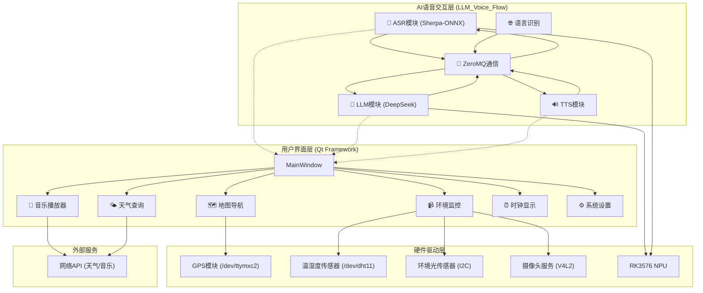

# 🚗 智能车载终端系统

[](https://isocpp.org/)
[](https://www.qt.io/)
[](https://cmake.org/)
[](https://www.linux.org/)
[](https://www.deepseek.com/)
[](https://www.rock-chips.com/)

这是一个基于 **Qt 5.15** 框架和 **C++** 开发的嵌入式Linux智能车载终端（In-Vehicle Infotainment, IVI）系统。它集成了地图导航、多媒体娱乐、环境监控和**全离线AI语音交互**等多种功能，基于**RK3576 NPU**实现端到端智能语音交互流水线，旨在为用户提供现代化、智能化的车载交互体验。

## ✨ 主要功能

### 🎯 核心功能模块
- **🎵 音乐播放器**: 支持本地音乐扫描与播放，集成网易云音乐API，可进行在线搜索、播放和歌词显示。
- **🗺️ 地图导航**: 集成百度地图服务，通过硬件GPS模块 (`/dev/ttymxc2`) 进行实时定位和导航，支持地图缩放显示。
- **🌤️ 天气查询**: 调用网络API，提供实时的天气信息和天气预报。
- **📹 环境监控**:
    - **视频监控**: 通过摄像头进行实时视频采集。
    - **环境感知**: 集成DHT11温湿度传感器和AP3216c环境光/距离传感器，实时显示环境数据。
    - **倒车辅助**: 倒车视频监控和距离预警显示。
- **⏰ 实用工具**: 包含美观的数字时钟和系统设置面板。
- **👆 手势操作**: 主界面支持滑动切屏操作。

### 🤖 AI语音交互系统 (LLM_Voice_Flow)
- **🎤 流式ASR语音识别**: 基于Sherpa-ONNX实现实时语音转文字，支持多语言识别。
- **🧠 离线大模型推理**: 集成DeepSeek-R1-Distill-Qwen-1.5B模型，基于RK3576 NPU实现本地化智能对话。
- **🔊 TTS语音合成**: 双缓冲队列优化的语音合成系统，实现流畅的语音输出。
- **🌐 语言识别**: 支持多语言自动识别，智能切换对话语言。
- **⚡ 模块化架构**: ASR/LLM/TTS模块通过ZeroMQ松耦合通信，实现4秒内语音交互闭环。
- **📱 智能指令解析**: 支持温湿度查询、时间显示、音乐控制、导航指令、天气查询等自然语言指令。

## 🌟 AI语音交互亮点

### 🚀 技术优势
- **🔒 完全离线**: 无需网络连接，保护用户隐私，适合车载环境
- **⚡ 低延迟响应**: 4秒内完成"语音输入→理解→回复→语音输出"全流程
- **🎯 高精度识别**: 基于Sherpa-ONNX的流式ASR，支持实时语音识别
- **🧠 智能理解**: DeepSeek大模型提供强大的自然语言理解能力
- **🔧 模块化设计**: 各模块独立部署，便于维护和升级

### 🎪 交互体验
- **🗣️ 自然对话**: 支持多轮对话，理解上下文语境
- **🌍 多语言支持**: 自动识别语言，智能切换对话语言
- **🎵 智能控制**: 语音控制音乐播放、导航、环境查询等功能
- **📊 实时反馈**: 流式语音合成，提供流畅的语音反馈

## 🏛️ 系统架构

系统采用**双层模块化设计**，包含Qt界面层和AI语音交互层。主窗口 (`MainWindow`) 作为入口，统一调度和管理各个功能模块。底层通过驱动直接与硬件交互，并通过网络API获取在线服务。AI语音交互系统通过ZeroMQ实现模块间松耦合通信。



## 🛠️ 技术栈

### 🖥️ 界面层技术栈
- **核心框架**: Qt 5.15.16 (Core, Gui, Widgets, Multimedia, Network, SerialPort)
- **编程语言**: C++20, C99
- **构建系统**: CMake
- **依赖管理**: vcpkg & apt
- **硬件接口**: `/dev` (串口, I2C), Video4Linux2 (V4L2)

### 🤖 AI语音交互技术栈
- **ASR引擎**: Sherpa-ONNX (流式语音识别)
- **大语言模型**: DeepSeek-R1-Distill-Qwen-1.5B
- **TTS引擎**: 自研双缓冲队列TTS系统
- **语言识别**: Whisper多语言识别模型
- **NPU推理**: RK3576 NPU + RKNN-LLM Runtime
- **通信协议**: ZeroMQ (模块间通信)
- **模型量化**: INT8量化优化

### 🌐 外部服务API
- **音乐服务**: 网易云音乐 API
- **地图服务**: 百度地图 API
- **天气服务**: 在线天气 API

## 🚀 快速开始

请按照以下步骤在您的 **Ubuntu / Debian** 系统上设置、编译和运行本项目。

### 1. 安装系统依赖

首先，运行脚本安装所有必需的系统库和工具，如 `build-essential`, `cmake`, `bison`, 以及 `X11` 和 `OpenGL` 的开发库。

```bash
chmod +x install_dependencies.sh
sudo ./install_dependencies.sh
```

### 2. 安装Qt5库

项目使用 `vcpkg` 来管理Qt5库。此脚本将自动通过vcpkg下载和编译Qt 5.15的核心模块。
> **提示**: vcpkg 会自动缓存下载的源码和编译好的库。如果初次执行失败，修复依赖后再次运行此脚本会快很多。

```bash
chmod +x install_qt5.sh
./install_qt5.sh
```
> 如果遇到需要重建依赖的提示，请使用 `--recurse` 选项，脚本已为您配置好。

### 3. 编译车载终端界面

一切准备就绪后，运行构建脚本。它将使用CMake来配置项目并进行编译。
```bash
chmod +x build.sh
./build.sh
```

### 4. 编译AI语音交互系统 (可选)

如需启用完整的AI语音交互功能，请编译LLM_Voice_Flow模块：

```bash
cd LLM_Voice_Flow

# 编译ZeroMQ通信库
cd zmq-comm-kit
mkdir build && cd build
cmake .. && make -j$(nproc)
cd ../..

# 编译TTS语音合成模块
cd tts
mkdir build && cd build
cmake .. && make -j$(nproc)
cd ../..

# 编译语音识别模块 (需要RK3576硬件)
cd voice/sherpa-onnx
mkdir build && cd build
cmake .. && make -j$(nproc)
cd ../../..

# 部署LLM模型 (需要RK3576 NPU)
cd llm/rknn-llm/examples/DeepSeek-R1-Distill-Qwen-1.5B_Demo
# 按照相应文档部署模型
```

### 5. 运行程序

#### 仅运行车载终端界面：
```bash
./build/bin/VehicleTerminal
```

#### 运行完整AI语音交互系统：
```bash
# 启动各个AI模块 (在不同终端中运行)
cd LLM_Voice_Flow

# 终端1: 启动TTS服务
./tts/build/tts_server

# 终端2: 启动ASR服务
./voice/sherpa-onnx/build/bin/sherpa-onnx-microphone

# 终端3: 启动LLM服务
./llm/rknn-llm/examples/DeepSeek-R1-Distill-Qwen-1.5B_Demo/deploy/llm_demo

# 终端4: 启动车载终端
./build/bin/VehicleTerminal
```

## 👨‍💻 开发者说明

### 📁 项目结构

```
VehicleTerminal/                    # Qt车载终端界面系统
├── main.cpp                       # 程序入口
├── mainwindow.*                    # 主窗口，UI和业务逻辑核心
├── speechrecognition.*             # 语音识别接口模块
├── Map/                           # 地图导航模块
├── Music/                         # 音乐播放模块
├── Weather/                       # 天气查询模块
├── Monitor/                       # 环境监控模块
└── *.c                           # C语言硬件驱动接口

LLM_Voice_Flow/                    # AI语音交互系统
├── voice/sherpa-onnx/             # ASR语音识别引擎
├── llm/rknn-llm/                  # DeepSeek大模型推理
├── tts/                           # TTS语音合成系统
├── zmq-comm-kit/                  # ZeroMQ通信库
└── docs/                          # 技术文档和数据集

build/                             # 构建输出目录
├── bin/VehicleTerminal            # 主程序可执行文件
└── compile_commands.json          # Clangd编译数据库

*.sh                               # 安装和构建脚本
CMakeLists.txt                     # CMake构建配置
```

### 开发环境配置 (Clangd)

为了获得最佳的开发体验（代码补全、语法检查），本项目已为 `clangd` 进行了优化配置。

1.  **生成编译数据库**: `build.sh` 脚本会自动在 `build/` 目录下生成 `compile_commands.json` 文件。
2.  **符号链接**: 脚本还会在项目根目录创建一个指向该文件的符号链接，方便 `clangd` 查找。
3.  **重启编辑器**: 首次构建后，请重启您的编辑器（如 VS Code / Cursor）以加载 `clangd` 配置。

### ⚠️ 注意事项

#### 硬件依赖
- **嵌入式硬件**: 本项目为嵌入式系统设计，部分功能（如GPS, 传感器）强依赖于特定的硬件设备文件（例如 `/dev/dht11`）。在非目标硬件上运行时，这些功能可能无法正常工作。代码中包含 `#if __arm__` 宏定义以在x86平台下提供模拟数据。
- **RK3576 NPU**: AI语音交互功能需要RK3576芯片的NPU支持。在其他平台上可能无法正常运行LLM推理。

#### API配置
- **API密钥**: 您可能需要自行替换代码中硬编码的API密钥或URL以使用在线服务（网易云音乐、百度地图、天气API）。
- **模型文件**: AI语音交互系统需要下载相应的模型文件（ASR模型、LLM模型、TTS模型）。

#### 调试指南
- **段错误调试**: 如果程序启动时遇到 `Segmentation fault`，通常是由于某个类的构造函数中指针未正确初始化或硬件模块初始化失败导致。请使用 `gdb` 进行调试：
  ```bash
  gdb ./build/bin/VehicleTerminal
  (gdb) run
  # 在程序崩溃后
  (gdb) bt
  ```
- **AI模块调试**: AI语音交互系统各模块独立运行，可单独调试每个模块的功能。

## 🎯 支持的语音指令

系统支持以下自然语言指令：
- **🌡️ 环境查询**: "显示温湿度"、"现在几点了"
- **🎵 音乐控制**: "播放音乐"、"下一首"、"上一首"、"单曲循环"、"音量调大"
- **🗺️ 导航功能**: "显示地图"、"放大地图"、"导航到..."
- **🌤️ 天气查询**: "今天天气怎么样"、"明天会下雨吗"
- **🚗 倒车辅助**: "显示倒车影像"、"显示倒车距离预警"

## 📚 相关文档

- [LLM_Voice_Flow/README.md](LLM_Voice_Flow/README.md) - AI语音交互系统详细文档
- [LLM_Voice_Flow/docs/](LLM_Voice_Flow/docs/) - 技术文档和数据集说明
- [智能座舱对话格式数据集](LLM_Voice_Flow/docs/智能座舱对话格式数据集.md) - 训练数据集设计

---

*这份 README 文档旨在提供清晰的项目指引。如果您有任何问题或建议，欢迎提交 Issue。*